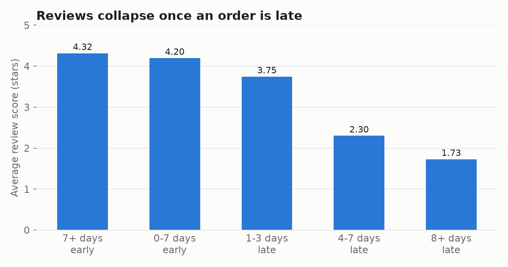
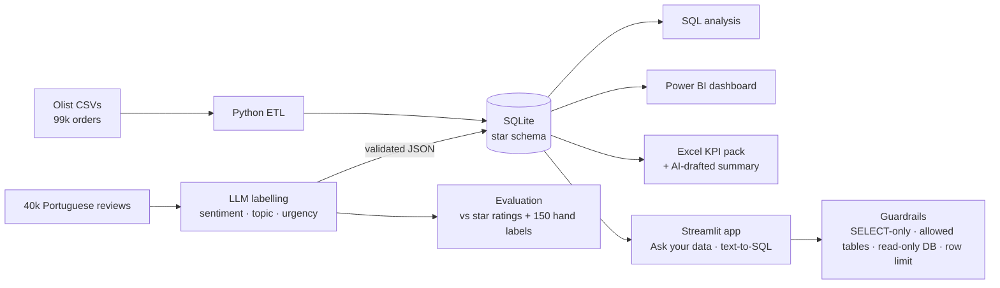
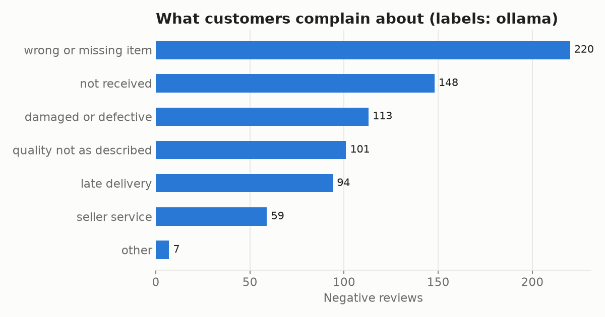

# 📦 AI Customer Insights: E-commerce Analytics with Free LLMs

**An end-to-end analytics project that uses a free local AI to turn written customer reviews into structured data (2,149 labelled so far; the same code scales to all 40,000), then answers business questions with SQL, Python, Power BI and Excel. The AI's accuracy is measured, not assumed.**

     

---

## The business problem

Olist is a Brazilian e-commerce marketplace with ~100k orders (2016–2018). Customers leave a star rating and often a written review in Portuguese. Managers can see the star ratings in a dashboard, but **nobody can read 40,000 reviews**, so they don't know *why* customers are unhappy or *what to fix first*.

This project answers three questions:

1. **What drives bad reviews?** (SQL + Power BI)
2. **What exactly are customers complaining about?** (AI reads every review)
3. **Can a manager just ask the data a question in plain English, safely?** (AI text-to-SQL app)

## Key findings

| # | Finding | Evidence |
|---|---|---|
| 1 | **Late delivery is the biggest driver of bad reviews.** Late orders average **2.57★** vs **4.29★** on time, and **54%** of late orders get 1–2 stars (vs 9%). | `sql/02_analysis_queries.sql` Q3 |
| 2 | The damage starts fast: **1–3 days late → 3.75★**, **8+ days late → 1.73★**. | Q4 |
| 3 | Only **8.1%** of orders are late, but it's very uneven by region: **Alagoas 23.9%**, **Maranhão 19.6%** vs **São Paulo 5.9%**. | Q6 |
| 4 | The AI shows the biggest complaint isn't speed: **wrong or missing items (30%)** and **not received (20%)** make up half of all complaints, ahead of late delivery (13%). Fulfilment accuracy matters as much as speed. | Q9 (AI labels, 2,149 reviews) |
| 5 | Repeat purchase is low for everyone (~3%), and a bad first review barely changes it (3.1% vs 3.2%). This marketplace's loyalty problem isn't caused by bad reviews alone. | Q7 |



**Recommendation:** check orders are packed correctly before dispatch, focus logistics on the north-east states with the highest late rates, and route "not received" / "wrong item" reviews (the *high-urgency* AI label) straight to customer service.

---

## How AI is used (and checked)



| AI feature | What it does | How it's kept honest |
|---|---|---|
| **Review labelling** (`scripts/03_label_reviews.py`) | Reads each Portuguese review and returns `sentiment`, `topic` (8 categories), `urgency` and an English summary as JSON | Output forced into allowed values; batches retried; results cached and resumable |
| **Accuracy evaluation** (`scripts/04_evaluate.py`) | Compares AI labels with the customer's own star rating **and** with 150 reviews labelled by hand | Confusion matrix + list of disagreements; a no-AI keyword baseline the LLM must beat |
| **Ask your data** (`app/streamlit_app.py`) | Plain-English question → SQL → answer + chart + one-sentence explanation | SQL always shown; SELECT-only, table allow-list, read-only connection, 10s timeout, 500-row limit; one automatic self-correction |
| **Executive summary** (`scripts/06_excel_kpi_pack.py`) | Drafts the monthly summary in Excel from the KPI numbers | Shown next to an "Analyst final" column and a "Checked?" column: a human signs off |

### AI accuracy

Evaluated on 150 hand-labelled reviews (`data/eval/gold_labels.csv`). Full report: [`results/evaluation.md`](results/evaluation.md).

| Method | Sentiment vs stars | Sentiment (hand labels) | Topic (hand labels) | **Complaint topic** |
|---|---|---|---|---|
| Keyword baseline (no AI) | 62.2% | 65.3% | 55.3% | 54.7% |
| **LLM via Ollama (local, free)** | **76.3%** | **84.7%** | **62.7%** | **73.3%** |
| Improvement | +14.1 pts | +19.4 pts | +7.4 pts | **+18.6 pts** |

**What this means:**
- On **complaints**, the reviews the business acts on, the LLM picks the right topic **73% of the time vs 55%** for keywords.
- Overall topic accuracy improves less (+7 pts) because the hardest cases are vague or mixed reviews ("other" vs "praise", or a review that mentions both a delay and a broken item). The confusion matrix in [`results/evaluation.md`](results/evaluation.md) shows exactly where it struggles.
- So the AI labels are good enough for **trends and prioritisation** (which complaint is growing?) but not for automatically making decisions about individual customers. That's why the dashboard shows the measured accuracy next to the AI charts.

> Sentiment vs stars is a deliberately tough check: people often give 5★ while mentioning a problem, or 1★ with a short neutral comment.



---

## Tech stack (all free)

| Layer | Tools |
|---|---|
| Data | Olist Brazilian E-commerce public dataset (9 tables) |
| Storage & SQL | SQLite (star schema), CTEs, window functions (`LAG`, `RANK`, `ROW_NUMBER`), `CASE` bucketing |
| Python | pandas, scikit-learn (metrics), requests, matplotlib, plotly |
| AI | **Ollama** (local, no key), or **Groq** / **Gemini** free tiers; same code via `src/llm.py` |
| App | Streamlit (deployable free on Streamlit Community Cloud) |
| BI | Power BI Desktop: star schema, DAX measures, time intelligence ([guide](powerbi/BUILD_GUIDE.md)) |
| Excel | KPI pack with `INDEX/MATCH` month selector, data validation, charts, formulas, not pasted values |
| Quality | pytest: SQL guardrails, JSON parsing, and an end-to-end test against a mock LLM server |

## Project structure

```
ai-customer-insights/
├── app/streamlit_app.py        # Overview · Ask your data · Review insights · AI quality
├── scripts/
│   ├── 01_download_data.py     # get the Olist CSVs
│   ├── 02_build_database.py    # clean + load star schema into SQLite
│   ├── 03_label_reviews.py     # AI labels for review text (resumable)
│   ├── 04_evaluate.py          # accuracy vs star ratings + hand labels
│   ├── 05_export_powerbi.py    # CSVs for Power BI
│   ├── 06_excel_kpi_pack.py    # Excel KPI pack + AI-drafted summary
│   ├── run_sql_analysis.py     # runs every business query -> results/
│   └── make_readme_charts.py
├── src/
│   ├── llm.py                  # one interface for Ollama / Groq / Gemini
│   ├── labels.py               # taxonomy, prompt, strict output validation
│   ├── rules_classifier.py     # no-AI keyword baseline
│   ├── text_to_sql.py          # question -> SQL -> answer
│   └── sql_guard.py            # guardrails for AI-written SQL
├── sql/                        # schema + 10 business queries
├── powerbi/                    # build guide + DAX measures (+ your .pbix)
├── excel/KPI_Pack.xlsx
├── data/eval/gold_labels.csv   # 150 hand-labelled reviews
├── results/                    # evaluation.md, sql_findings.md
└── tests/
```

## Run it yourself

```bash
git clone https://github.com/shobkro/ai-customer-insights.git
cd ai-customer-insights
python -m venv .venv && source .venv/bin/activate   # Windows: .venv\Scripts\activate
pip install -r requirements.txt

# Free local AI (recommended)
#   1. install Ollama from https://ollama.com
#   2. ollama pull qwen2.5:7b        (8 GB RAM? use qwen2.5:3b)
cp .env.example .env                 # Windows: copy .env.example .env

python run_all.py                    # full pipeline with AI (~30-60 min for 2,000 reviews on a laptop)
python run_all.py --provider rules   # or: no AI at all, finishes in ~1 minute
streamlit run app/streamlit_app.py
pytest -q
```

No GPU or paid key is needed. Groq and Gemini are drop-in alternatives with free tiers (set them in `.env`).

### Deploy the app for free
Push to GitHub → [share.streamlit.io](https://share.streamlit.io) → New app → `app/streamlit_app.py`.
The app builds its database on first start. Without an AI key it runs in **demo mode** (example questions);
add `LLM_PROVIDER=groq` and `GROQ_API_KEY` in the app's *Secrets* to enable free-form questions.

## What I'd do next
- Fine-tune a small open model on the hand-labelled reviews and compare it with prompting
- Add a delivery-delay prediction model (which orders will be late?) and feed it to the dashboard
- Move the database to PostgreSQL and schedule the pipeline

## Data & licence
Data: [Brazilian E-Commerce Public Dataset by Olist](https://www.kaggle.com/datasets/olistbr/brazilian-ecommerce), licensed **CC BY-NC-SA 4.0**. Seller/brand names in reviews were anonymised by Olist (e.g. "lannister", "stark").
Code: MIT licence.
